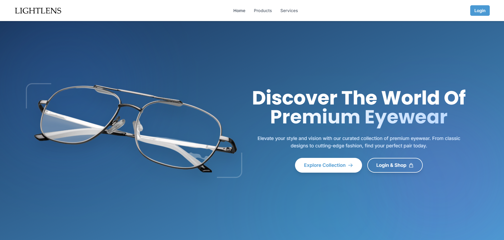
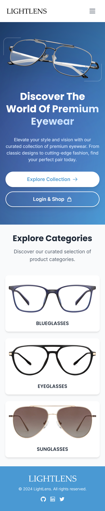

# Light-Lens
An ecommerce website for spectacles built using Reactjs.

# Features
- 🛍️ Seamless Shopping Experience: Add, remove, and manage items in your cart with persistent localStorage, “Save for Later,” and complete checkout flow.
- 🔍 Powerful Product Discovery: Instantly filter by category, color, shape, price, and rating, with real-time search and sorting options.
- 🔐 Secure User Authentication: Google Sign-In via Firebase with session persistence, automatic logout, and dedicated auth pages.
- 📱 Responsive & Optimized UI: Tailwind-powered mobile-first design with lazy loading, animated transitions, and UX enhancements.
- ⚙️ Modern Tech Stack: Built with React, Context API, React Router, Firebase, Vite, and Cloudinary for fast, scalable performance.

# Tech Stack:
 - Reactjs
 - useContext API
 - Tailwind CSS
 - Framer Motion
 - Firebase

## Screenshots:
### Desktop:

### Mobile:

